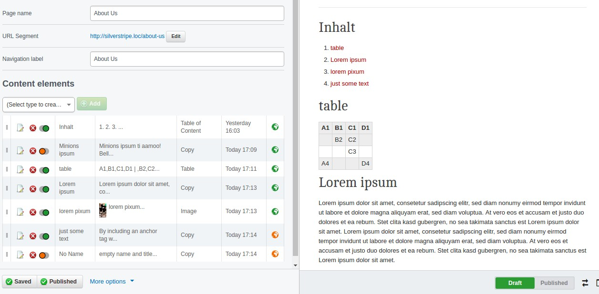

# silverstripe-flexible-content
Content pages based on data objects for better content structure




## Features
 - Supports draft/publish state
 - Drag n drop reordering
 - Copy & Paste
 - Black/white listing of block types
 
### Disregards
 - Same content element on different pages

### Difference to SilverStripe Blocks
Silverstripe Blocks has more features like block sets, forms ,... But the ui of Flexible-Content
is more simple and easier to understand and use for non technical users.
 

## Installation

```sh
composer require nblum/silverstripe-flexible-content
```

For a basic set of content element you may install the 
[elements-package](https://github.com/nblum/silverstripe-flexible-content-elements):
 
```sh
composer require nblum/silverstripe-flexible-content-elements
```

 1. Create a page template ```ContentPage``` in your theme and add
    ```
        $FlexibleContent
    ```
 1. Run ```dev/build?flush=1```
 1. Change the Page type to "Content Page" of every page you like


## Configuration

Edit your config.yml file and add the following lines. This is the default config and
only necessary if changes are neede
```yml
FlexibleContent:
  availableContentElements:
    false
  forbiddenContentElements:
    - ContentElement
```

## Custom Content Elements
Create a class which extends the ContentElement class or any other existing content element.

```php
<?php

class MyTextContentElement extends Nblum\FlexibleContent\TextContentElement
{

    private static $db = array(
        'Splitview' => 'Boolean'
    );

    public function getCMSFields()
    {
        $fields = parent::getCMSFields();

        $field = new CheckboxField('MyCheckbox', 'a checkbox');
        $fields->addFieldToTab('Root.Main', $field);

        return $fields;
    }
}
```

And provide a include template file with the same name

```html
    <div <%if $Splitview %> class="splitview" <% end_if %>
        $Content
    </div>
```

